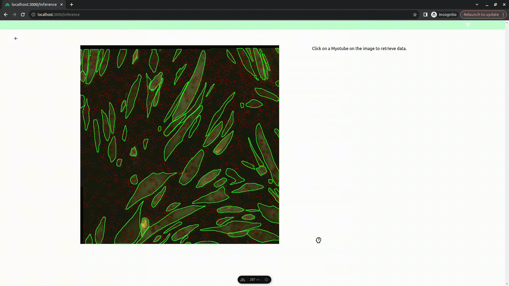

# myovision

[](https://www.en.statistik.uni-muenchen.de/index.html)
[](https://opensource.org/licenses/MIT)

## Description

This is the main repository for the Consulting Project: **"Quantification of Myogenic Differentiation using Deep Learning"**, developed at the [Ludwig Maximilian University of Munich](https://www.statistik.uni-muenchen.de/index.html) in partnership with [Musculoskeletal Center](https://www.lmu-klinikum.de/mum-lmu) at the LMU University Hospital.

## Supervisors and Project Partner

- Supervisors: [Prof. Dr. David Rügamer](https://www.m-datascience.mathematik-informatik-statistik.uni-muenchen.de/People/professors/ruegamer/index.html) and [Tobias Weber](https://www.slds.stat.uni-muenchen.de/people/weber/)

- Project Partner: [Dr. rer. nat. Maximilian Saller](https://www.lmu-klinikum.de/mum-lmu/287b7a2983b88c7a/e7ce030587e73f0c)

## Project Structure

1. [Main Repository](https://github.com/Noza23/myovision) (this repository)
   Contains notebooks for presentig main results of the project. Notebooks are located in the `notebooks` directory:

   - `01_predict_performance.ipynb`: Prediction and Performance Computation.
   - `02_exploratory_data_analysis.ipynb`: Exploratory Data Analysis
   - `03_classical_cv.ipynb`: Classical Computer Vision Techniques
   - `04_presentation_plots.ipynb`: Presentation Plots

2. [Data Collection](https://github.com/Noza23/myovision-data-utils)
   Contains scripts for collecting and preprocessing training data.
   For data annotation process we employed a specificly designed tool which is not public for now but we provide a visualization of the data annotation process:

   ```
   If you are interested in the Data Annotation Tool, please contact us.
   ```

   

3. [Model Training / Inference](https://github.com/Noza23/myovision-sam)
   Contains the modules for Training and Inference of segment-anything model for myotube segmentation and stardist model for nuclei segmentation.

   Visualisation of Inferece process in the designed tool:

   ```
   If you are interested in the Inference Tool, please contact us.
   ```

   

4. [Project Report](https://github.com/davetornado/myovision-report)
   Contains the Final Report of the project.

5. [App Backend](https://github.com/Noza23/myovision-app)
   Contains the Backend of the Web Application.

6. [App Frontend](https://github.com/davitchanturia/myovision-app-front)
   Contains the Frontend of the Web Application.

## MyoSAM Model

- [MyoSAM checkpoint](https://drive.google.com/file/d/1wAlAgqo_NCNnrE8zjQFIkHXpLhTjg3fs/view?usp=sharing)

## Maintainer

```python
{
    name = "Giorgi Nozadze",
    email = "giorginozadze23@yahoo.com"
}
```

## Acknowledgements

We would like to thank:

- Our **Supervisors and Project Partner** for their support and guidance throughout the project.

- **Musculoskeletal Center at the LMU University Hospital** for providing the necessary infrastructure and resources for the project.

- Meta AI for their open-source research and materials **[Segment Anything](https://github.com/facebookresearch/segment-anything)**. We used their work for **instance segmentation of myotube images**.

```
@article{kirillov2023segany,
  title={Segment Anything},
  author={Kirillov, Alexander and Mintun, Eric and Ravi, Nikhila and Mao, Hanzi and Rolland, Chloe and Gustafson, Laura and Xiao, Tete and Whitehead, Spencer and Berg, Alexander C. and Lo, Wan-Yen and Doll{\'a}r, Piotr and Girshick, Ross},
  journal={arXiv:2304.02643},
  year={2023}
}
```

- Developers of the **[StarDist](https://github.com/stardist/stardist)** project for making their great work avaliablle open-source. We used their model for **instance segmentation of nuclei images**.

```
@inproceedings{schmidt2018,
  author    = {Uwe Schmidt and Martin Weigert and Coleman Broaddus and Gene Myers},
  title     = {Cell Detection with Star-Convex Polygons},
  booktitle = {Medical Image Computing and Computer Assisted Intervention - {MICCAI}
  2018 - 21st International Conference, Granada, Spain, September 16-20, 2018, Proceedings, Part {II}},
  pages     = {265--273},
  year      = {2018},
  doi       = {10.1007/978-3-030-00934-2_30}
}

@inproceedings{weigert2020,
  author    = {Martin Weigert and Uwe Schmidt and Robert Haase and Ko Sugawara and Gene Myers},
  title     = {Star-convex Polyhedra for 3D Object Detection and Segmentation in Microscopy},
  booktitle = {The IEEE Winter Conference on Applications of Computer Vision (WACV)},
  month     = {March},
  year      = {2020},
  doi       = {10.1109/WACV45572.2020.9093435}
}
```
